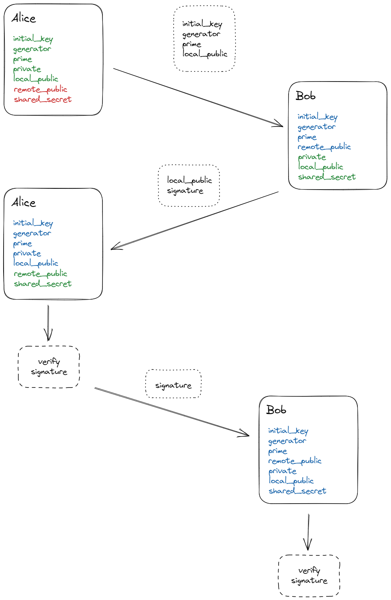

## Goal

The goal of this process is to create a mutually agreed blowfish key through a Diffie-Hellman-like key exchange 

If you don't know what Diffie-Hellman is or how it works it might be a good idea to read up on that first:
- [Computerphile explanation video (without math)](https://www.youtube.com/watch?v=NmM9HA2MQGI)
- [Computerphile explanation video (with math)](https://www.youtube.com/watch?v=Yjrfm_oRO0w)
- [Wikipedia (both, non-math and math explanations)](https://en.wikipedia.org/wiki/Diffie%E2%80%93Hellman_key_exchange)

## Pre-Requisites / State
Both parties must keep track of the following data:

```rust
struct Context {
    // required to calculate the final blowfish key
    initial_key: u64,
    
    // g
    generator: u32,
    
    // n
    prime: u32,
    
    // a
    private: u32,
    
    // ag
    local_public: u32,
    
    // bg
    remote_public: u32,
    
    // abg (required to calculate the final blowfish key)
    shared_secret: u32,
}
```

## Process
_(keep in mind that the `local_public` of Alice is the `remote_public` for Bob)_



### Init
Alice generates `initial_key`, `generator`, `prime`, `private` and `local_public` locally.
`initial_key`, `generator`, `prime` and `local_public` are then sent to the counter-party, Bob.

### Key generation for Bob
Bob will locally generate his `private` and `local_public`.
With the received `remote_public` he can calculate the `shared_secret`.
Bob is now able to create a signature (by combining `local_public`, `remote_public` and `shared_secret`) which he encodes with a temporary blowfish key 
(that is also calculated by combining `local_public`, `remote_public` and `shared_secret`).  
The generated signature is sent back to Alice, aside with his `local_public`.  

=> The key exchange is now finished for Bob. He holds all the necessary information to generate the final blowfish key.


### Finalizing the Key Exchange for Alice and creating the Blowfish key
With the received `remote_public` from Bob, Alice is now able to calculate the `shared_secret` as well.    
Just like Bob she will create a signature from `local`, `remote` and `shared` and encode that with the temporary Blowfish key.  
A matching signature (the one that Bob sent and the one just created by Alice) ensures that the KeyExchange was successful.  
Alice can now initialize Blowfish on her side with the final key, by combining `shared_secret` and the `initial_key` which she created in the initial step.  
Before finalizing the process, Alice will send her local generated signature to Bob as well.

### Creating the Blowfish Key on Bobs side.
Bob already holds all the necessary data-points to create the blowfish key.  
The only step remaining for him is to ensure his local generated signature and the one just sent by Alice do match (basically repeating the last from Alice' side).  
If they match, he will also generate the final blowfish key by combining the `shared_secret` and the `initial_key` Alice has sent in the inital step.
